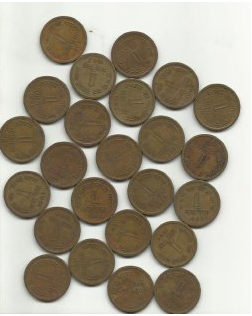
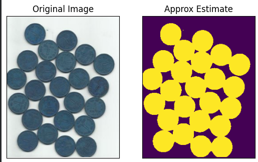
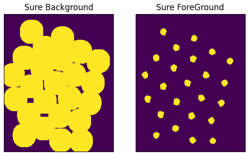
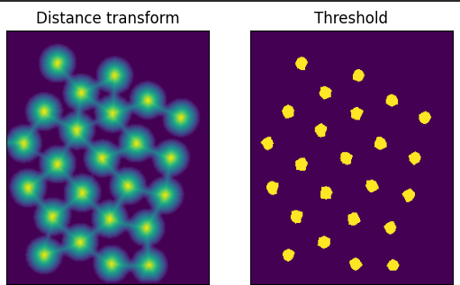
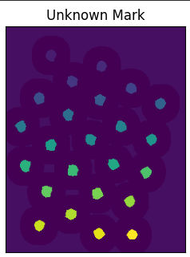
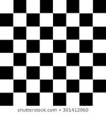
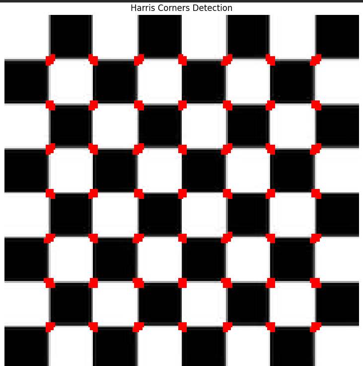
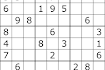

# Python Programming: Digital Image Processing

| Field | Details |
|-------|---------|
| **Name** | Oshan |
| **Roll No** | 230328 |
| **Faculty** | BCE |
| **Lab** | Python Programming — Digital Image Processing |

---

## Title
**Lab 5: Image Segmentation**

---

## Objective

- To understand the concept of image segmentation using the Watershed algorithm.
- To implement marker-based watershed segmentation to separate foreground objects from the background.
- To detect corners in an image using the Harris Corner Detection algorithm.
- To detect edges and lines in an image using the Hough Transform.

---

## Theory

### Watershed Algorithm

Any grayscale image can be viewed as a topographic surface where high intensity denotes peaks and hills while low intensity denotes valleys. The watershed algorithm works by simulating the flooding of this surface:

- Every isolated valley (local minimum) is filled with differently colored water (labels).
- As the water rises, water from different valleys starts to merge.
- To avoid merging, barriers are built at merge locations.
- The process continues until all peaks are under water — the barriers form the segmentation boundaries.

This naive approach often produces **over-segmented results** due to noise or image irregularities.

OpenCV implements a **marker-based watershed algorithm** to overcome this:

| Region | Label |
|--------|-------|
| Sure foreground (object) | Non-zero positive integer |
| Sure background | 1 (after marker shift) |
| Unknown region | 0 |
| Final boundary (post-watershed) | -1 |

The algorithm updates the markers, and object boundaries are assigned a value of **-1** in the final output.

---

### Harris Corner Detection

Harris Corner Detection identifies corners in an image by analyzing local intensity changes in multiple directions. A corner is a point where intensity changes significantly in all directions. The algorithm uses the **structure tensor** of the image gradient to compute a corner response function.

Key parameter: `k` (Harris detector free parameter, typically 0.04–0.06).

---

### Hough Transform

The Hough Transform is used to detect geometric shapes (lines, circles) in images. For line detection:

- The image is first converted to a binary edge map using **Canny Edge Detection**.
- Each edge point votes in a parameter space (ρ, θ) for all possible lines passing through it.
- Lines with the most votes (above a threshold) are detected.

---

## Lab Tasks

---

### Task 1: Image Segmentation Using Watershed Algorithm

#### Code

```python
import numpy as np
import cv2 as cv
from matplotlib import pyplot as plt

img = cv.imread('coins.PNG')
gray = cv.cvtColor(img, cv.COLOR_BGR2GRAY)
ret, thresh = cv.threshold(gray, 0, 255, cv.THRESH_BINARY_INV + cv.THRESH_OTSU)

plt.subplot(121), plt.imshow(img)
plt.title('Original Image'), plt.xticks([]), plt.yticks([])
plt.subplot(122), plt.imshow(thresh)
plt.title('Approx Estimate'), plt.xticks([]), plt.yticks([])
plt.show()

# ------------------------------------------------------------------
# Noise removal
kernel = np.ones((3, 3), np.uint8)
opening = cv.morphologyEx(thresh, cv.MORPH_OPEN, kernel, iterations=2)

# Sure background area
sure_bg = cv.dilate(opening, kernel, iterations=3)

# Finding sure foreground area
dist_transform = cv.distanceTransform(opening, cv.DIST_L2, 5)
ret, sure_fg = cv.threshold(dist_transform, 0.7 * dist_transform.max(), 255, 0)

plt.subplot(121), plt.imshow(sure_bg)
plt.title('Sure Background'), plt.xticks([]), plt.yticks([])
plt.subplot(122), plt.imshow(sure_fg)
plt.title('Sure ForeGround'), plt.xticks([]), plt.yticks([])
plt.show()

# ------------------------------------------------------------------
# Finding unknown region
sure_fg = np.uint8(sure_fg)
unknown = cv.subtract(sure_bg, sure_fg)

plt.subplot(121), plt.imshow(dist_transform)
plt.title('Distance transform'), plt.xticks([]), plt.yticks([])
plt.subplot(122), plt.imshow(sure_fg)
plt.title('Threshold'), plt.xticks([]), plt.yticks([])
plt.show()

# ------------------------------------------------------------------
# Marker labelling
ret, markers = cv.connectedComponents(sure_fg)

# Add one to all labels so that sure background is not 0, but 1
markers = markers + 1

# Mark the region of unknown with zero
markers[unknown == 255] = 0

plt.subplot(121), plt.imshow(markers)
plt.title('Unknown Mark'), plt.xticks([]), plt.yticks([])
plt.show()

# ------------------------------------------------------------------
markers = cv.watershed(img, markers)
img[markers == -1] = [255, 0, 0]

plt.subplot(121), plt.imshow(markers), plt.title('Marker Image After Segmentation')
plt.xticks([]), plt.yticks([])
plt.subplot(122), plt.imshow(img), plt.title('Final Result')
plt.xticks([]), plt.yticks([])
plt.show()
```

#### Input

#### Output





#### Observation

The watershed algorithm successfully segmented the coins image. Otsu's thresholding provided an initial binary estimate. Morphological opening removed noise, while dilation and distance transform identified sure background and foreground regions respectively. Connected components labeled distinct foreground objects, and the watershed algorithm drew red boundary lines (marker value = −1) between touching coins, achieving clean separation of individual objects.

---

### Task 2: Corner Detection Using Harris Corner Detection

#### Code

```python
import cv2
import numpy as np
import matplotlib.pyplot as plt

# Load the image
filename = 'chessboard.jpg'
img = cv2.imread(filename)
if img is None:
    raise FileNotFoundError(f"Image file '{filename}' not found.")

# Convert to grayscale
gray = cv2.cvtColor(img, cv2.COLOR_BGR2GRAY)

# Apply Harris Corner Detection
gray = np.float32(gray)
dst = cv2.cornerHarris(gray, 2, 3, 0.04)

# Dilate result for better visibility
dst = cv2.dilate(dst, None)

# Mark the corners in red
img[dst > 0.01 * dst.max()] = [0, 0, 255]

# Convert BGR to RGB for displaying with matplotlib
img_rgb = cv2.cvtColor(img, cv2.COLOR_BGR2RGB)

# Display the result using matplotlib
plt.figure(figsize=(10, 10))
plt.imshow(img_rgb)
plt.title('Harris Corners Detection')
plt.axis('off')
plt.show()
```
#### Input

#### Output


#### Observation

The Harris Corner Detection algorithm successfully identified corners on the chessboard image. The detected corners are highlighted in red, appearing precisely at the intersection points of the chessboard squares. The dilation step enhanced the visibility of corner markers. The algorithm correctly responded to points where intensity changes significantly in multiple directions, which is the defining property of a corner.

---

### Task 3: Edge Detection Using Hough Transform

#### Code

```python
import cv2
import numpy as np

img = cv2.imread('k1.jpg')
gray = cv2.cvtColor(img, cv2.COLOR_BGR2GRAY)
edges = cv2.Canny(gray, 50, 150, apertureSize=3)

lines = cv2.HoughLines(edges, 1, np.pi / 180, 200)

for line in lines:
    rho, theta = line[0]
    a = np.cos(theta)
    b = np.sin(theta)
    x0 = a * rho
    y0 = b * rho
    x1 = int(x0 + 1000 * (-b))
    y1 = int(y0 + 1000 * (a))
    x2 = int(x0 - 1000 * (-b))
    y2 = int(y0 - 1000 * (a))
    cv2.line(img, (x1, y1), (x2, y2), (0, 0, 255), 2)

cv2.imwrite('output.jpg', img)
```

#### Input

#### Output
True


#### Observation

The Hough Transform successfully detected prominent straight lines in the image. Canny edge detection first extracted edge points using thresholds of 50 and 150, followed by the Hough Transform voting in (ρ, θ) space. Lines accumulating more than 200 votes were detected and drawn in red over the original image. The algorithm identified the dominant linear structures, demonstrating its robustness for geometric line detection in natural and structured scenes.

---

## Conclusion
In this lab, the Watershed algorithm, Harris Corner Detection, and Hough Transform were successfully implemented using OpenCV and Python. The Watershed algorithm segmented overlapping objects, Harris Corner Detection identified corner points, and the Hough Transform detected straight lines effectively. Overall, these techniques demonstrated fundamental image segmentation and feature detection methods used in computer vision.