# Python Programming: Digital Image Processing

| Field | Details |
|-------|---------|
| **Name** | Oshan |
| **Roll No** | 230328 |

---

## Title
**Image Processing — SIFT, Image Segmentation, Edge Detection, Hough Transform, and Point Detection**

---

## Objective

- To detect and visualize keypoints in an image using the SIFT (Scale-Invariant Feature Transform) algorithm.
- To perform image segmentation using Global, Adaptive, and Otsu thresholding techniques.
- To apply Sobel, Laplacian, and Canny edge detection methods and compare their results.
- To detect straight lines in an image using the Hough Line Transformation.
- To detect isolated points in an image using a point detection mask and thresholding.

---

## Theory

### Part I: SIFT (Scale-Invariant Feature Transform)

SIFT is a feature detection algorithm that identifies keypoints in an image that are invariant to scale, rotation, and illumination changes.

| Concept | Description |
|---------|-------------|
| Keypoint | A distinctive point in the image (corner, blob, edge junction) |
| Descriptor | A 128-dimensional vector describing the local appearance around a keypoint |
| `cv2.SIFT_create()` | Creates a SIFT detector object |
| `detectAndCompute()` | Detects keypoints and computes their descriptors simultaneously |
| `cv2.drawKeypoints()` | Draws detected keypoints on the image |

---

### Part II: Image Segmentation and Thresholding

Thresholding separates objects from the background by converting a grayscale image into a binary image based on pixel intensity.

| Method | Description |
|--------|-------------|
| Global Thresholding | Uses a single fixed threshold T computed from image statistics (iterative mean method) |
| Adaptive Thresholding | Threshold varies across the image based on local neighborhood mean |
| Otsu's Thresholding | Automatically finds the optimal global threshold by minimizing intra-class variance |
| `cv2.adaptiveThreshold()` | Applies adaptive thresholding with mean or Gaussian weighting |
| `cv2.threshold()` with `THRESH_OTSU` | Applies Otsu's method automatically |

---

### Part III: Edge Detection

Edge detection identifies boundaries within an image by locating rapid changes in pixel intensity.

| Method | Type | Description |
|--------|------|-------------|
| Sobel | First-order derivative | Computes gradient in X and Y directions separately; combined for full edge map |
| Laplacian | Second-order derivative | Detects edges using the Laplacian operator; sensitive to noise |
| Canny | Multi-stage | Applies Gaussian smoothing, gradient computation, non-maximum suppression, and hysteresis thresholding |

---

### Part IV: Hough Line Transformation

The Hough Transform detects geometric shapes (lines, circles) in an image by mapping edge points to a parameter space.

| Concept | Description |
|---------|-------------|
| Hough Space | Parameter space (ρ, θ) where each edge point votes for possible lines |
| `cv2.HoughLines()` | Detects lines using the Standard Hough Transform |
| ρ (rho) | Perpendicular distance from the origin to the line |
| θ (theta) | Angle of the perpendicular from the origin |

---

### Part V: Isolated Point Detection

Isolated points are single pixels that differ significantly from all their neighbors. They are detected using a Laplacian-like mask followed by thresholding.

| Concept | Description |
|---------|-------------|
| Point Detection Mask | A 3×3 kernel with center weight +8 and neighbor weights −1 |
| `cv2.filter2D()` | Applies a custom convolution kernel to the image |
| Thresholding | Pixels exceeding 90% of the maximum filtered value are marked as isolated points |

---

## Lab Tasks

---

### Task 1: SIFT — Scale-Invariant Feature Transform

#### Code

```python
# Scale-Invariant Feature Transform (SIFT)
import cv2
import matplotlib.pyplot as plt
import numpy as np

# Reading Input Image
image = cv2.imread('/content/home.jpg', cv2.IMREAD_GRAYSCALE)

# Detecting Keypoints
siftObj = cv2.SIFT_create()
keyPoints, descriptors = siftObj.detectAndCompute(image, None)

# Drawing Keypoints on Input Image
result = cv2.drawKeypoints(image, keyPoints, None)

# Displaying Results
fig = plt.figure(figsize=(15, 6))
ax1 = fig.add_subplot(121)
ax2 = fig.add_subplot(122)
ax1.imshow(image, cmap='gray')
ax1.title.set_text('Original Image')
ax2.imshow(result)
ax2.title.set_text('Image with Keypoints using SIFT')
```

#### Input Image


#### Output

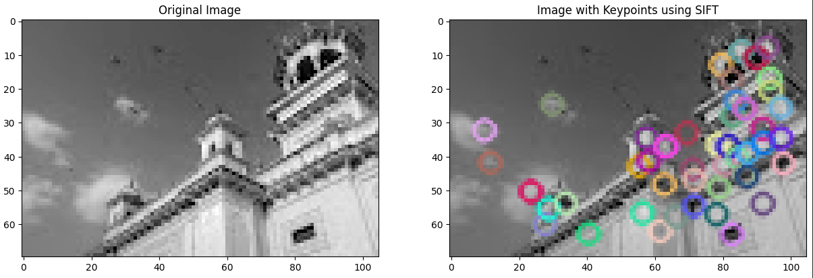

#### Observation

SIFT detected multiple keypoints on the image, shown as circles with orientation lines. Keypoints are concentrated at prominent features such as corners, edges, and textured regions. Each circle's size represents the scale at which the feature was detected, and the line indicates its dominant orientation. SIFT keypoints are robust to scale and rotation changes.

---

### Task 2: Image Segmentation — Histogram Analysis

#### Code

```python
import cv2
import matplotlib.pyplot as plt
import numpy as np

# Image segmentation
image = cv2.imread('/content/fingerprint.jpg', cv2.IMREAD_GRAYSCALE)

fig = plt.figure(figsize=(15, 4))
ax1 = fig.add_subplot(121)
ax2 = fig.add_subplot(122)
ax1.imshow(image, cmap='gray')
ax1.title.set_text('Original Image')
ax2.hist(image.ravel(), bins=256)
ax2.title.set_text('Histogram')
```

#### Input Image

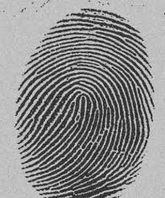

#### Output

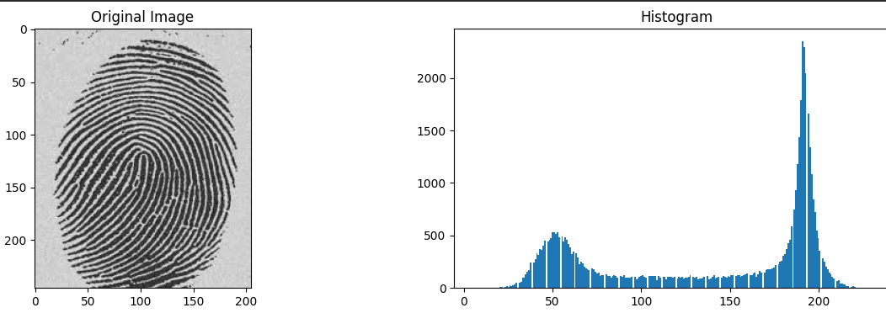

#### Observation

The histogram of the fingerprint image shows the distribution of pixel intensities across 256 bins. Two dominant peaks are visible — one in the darker region (fingerprint ridges) and one in the brighter region (background). This bimodal distribution confirms that thresholding can effectively separate the two regions.

---

### Task 3: Image Segmentation — Global, Adaptive, and Otsu Thresholding

#### Code

```python
import cv2
import numpy as np
import matplotlib.pyplot as plt

image = cv2.imread('/content/fingerprint.jpg', cv2.IMREAD_GRAYSCALE)

# Global Thresholding (Iterative Mean Method)
T = (np.max(image) + np.min(image)) / 2
T0 = 0.5   # Tolerance

while True:
    print(f"Threshold = {T}")
    flat_image = image.ravel()
    u1_pixels = flat_image[flat_image > T]
    u2_pixels = flat_image[flat_image <= T]
    if len(u1_pixels) == 0 or len(u2_pixels) == 0:
        break
    m1 = np.mean(u1_pixels)
    m2 = np.mean(u2_pixels)
    T_new = (m1 + m2) / 2
    if abs(T_new - T) < T0:
        T = T_new
        break
    T = T_new

global_thres = image > T

# Adaptive Thresholding (Mean of Neighbourhood)
adaptive_thres = cv2.adaptiveThreshold(
    image, 255, cv2.ADAPTIVE_THRESH_MEAN_C,
    cv2.THRESH_BINARY, 11, 2)

# Otsu Thresholding
ret, otsu_thres = cv2.threshold(
    image, 124, 255, cv2.THRESH_BINARY + cv2.THRESH_OTSU)

# Displaying Results
fig = plt.figure(figsize=(12, 4))
ax1 = fig.add_subplot(131)
ax2 = fig.add_subplot(132)
ax3 = fig.add_subplot(133)
ax1.imshow(global_thres, cmap='gray')
ax1.title.set_text(f'Global Thresholded Image for T={T}')
ax2.imshow(adaptive_thres, cmap='gray')
ax2.title.set_text('Adaptive Thresholded Image')
ax3.imshow(otsu_thres, cmap='gray')
ax3.title.set_text('Otsu Thresholded Image')
```

#### Output

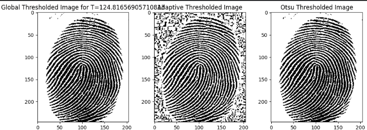

#### Observation

| Method | Observation |
|--------|-------------|
| Global Thresholding | Uses an iteratively computed mean threshold; works well for images with clearly bimodal histograms but may struggle with uneven illumination |
| Adaptive Thresholding | Computes a local threshold for each pixel using the neighborhood mean; handles uneven lighting better and preserves fine ridge details |
| Otsu Thresholding | Automatically finds the optimal global threshold by minimizing intra-class variance; produces a clean binary image for well-separated intensity distributions |

---

### Task 4: Edge Detection — Sobel Filter

#### Code

```python
import cv2
import numpy as np
import matplotlib.pyplot as plt

image = cv2.imread('/content/road.jpg', cv2.IMREAD_GRAYSCALE)
image = cv2.GaussianBlur(image, (3, 3), 0)

plt.imshow(image, cmap='gray')
plt.title('Original Image After Gaussian Blurring')
plt.show()

# Sobel Edge Detection
sobelX = cv2.Sobel(image, cv2.CV_8U, 1, 0, ksize=3).astype(np.uint64)
sobelY = cv2.Sobel(image, cv2.CV_8U, 0, 1, ksize=3).astype(np.uint64)
sobel  = np.sqrt(np.power(sobelX, 2) + np.power(sobelY, 2)).astype(np.uint64)

fig = plt.figure(figsize=(12, 4))
ax1 = fig.add_subplot(131)
ax2 = fig.add_subplot(132)
ax3 = fig.add_subplot(133)
ax1.imshow(sobelX, cmap='gray')
ax1.title.set_text('Sobel Filter in X Direction')
ax2.imshow(sobelY, cmap='gray')
ax2.title.set_text('Sobel Filter in Y Direction')
ax3.imshow(sobel, cmap='gray')
ax3.title.set_text('Sobel Filter Combined X,Y')
```

#### Input Image

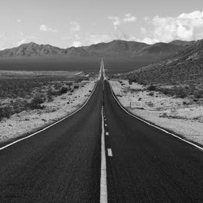

#### Output — Gaussian Blurred Image

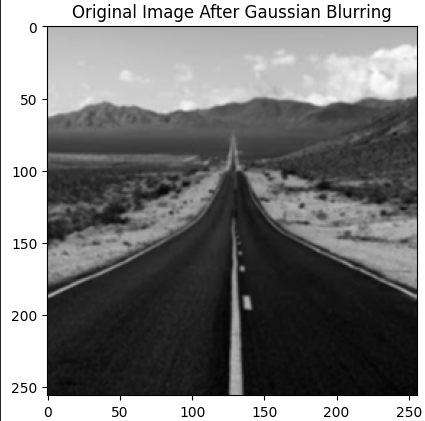

#### Output — Sobel Edge Detection

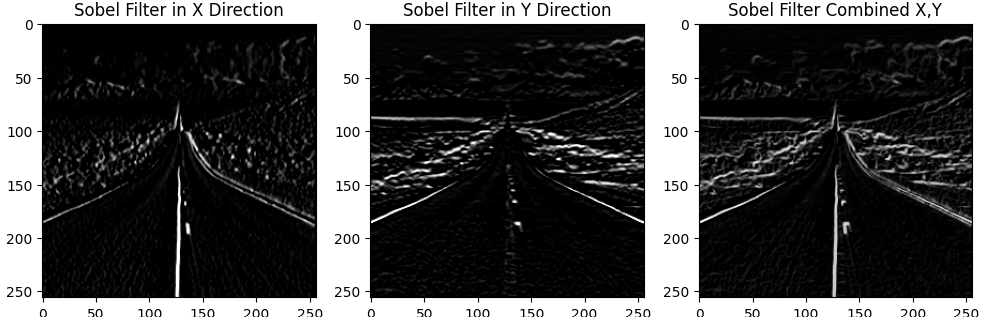

#### Observation

The image was first smoothed with a 3×3 Gaussian kernel to reduce noise before edge detection. The Sobel filter in the X direction detects vertical edges (horizontal intensity changes), while the Y direction detects horizontal edges (vertical intensity changes). The combined Sobel magnitude highlights all edges regardless of orientation, clearly outlining road boundaries, lane markings, and structural features.

---

### Task 5: Edge Detection — Laplacian Filter

#### Code

```python
import cv2
import matplotlib.pyplot as plt

image = cv2.imread('/content/road.jpg', cv2.IMREAD_GRAYSCALE)
image = cv2.GaussianBlur(image, (3, 3), 0)

# Laplacian Edge Detection
laplacian = cv2.Laplacian(image, cv2.CV_8U)

plt.imshow(laplacian, cmap='gray')
plt.title('Laplacian Edge Detection')
plt.show()
```

#### Output

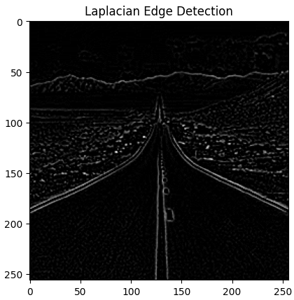

#### Observation

The Laplacian filter applies a second-order derivative to detect edges in all directions simultaneously. The result shows thin, well-defined edge lines highlighting rapid intensity transitions. However, as a second-order operator, the Laplacian is more sensitive to noise than first-order methods like Sobel, making the Gaussian pre-blur an important preprocessing step.

---

### Task 6: Edge Detection — Canny Edge Detector

#### Code

```python
import cv2
import matplotlib.pyplot as plt

image = cv2.imread('/content/road.jpg', cv2.IMREAD_GRAYSCALE)
image = cv2.GaussianBlur(image, (3, 3), 0)

# Canny Edge Detector
THRESHOLD1 = 100
THRESHOLD2 = 200
canny = cv2.Canny(image, THRESHOLD1, THRESHOLD2)

fig = plt.figure(figsize=(10, 4))
ax1 = fig.add_subplot(121)
ax2 = fig.add_subplot(122)
ax1.imshow(image, cmap='gray')
ax1.title.set_text('Gaussian Blurred Image')
ax2.imshow(canny, cmap='gray')
ax2.title.set_text('Canny Edge Detection')
```

#### Output

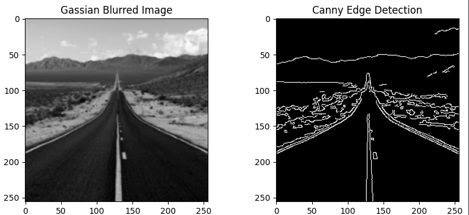

#### Observation

Canny edge detection (thresholds 100 and 200) produced the cleanest and most precise edge map among all three methods. The two-threshold hysteresis approach keeps only strong, connected edges and suppresses weak, isolated noise edges. Road lane markings, vehicle outlines, and structural boundaries are detected with sharp, thin, single-pixel-wide edges, confirming Canny as the most effective general-purpose edge detector.

---

### Task 7: Hough Line Transformation

#### Code

```python
import cv2
import numpy as np
import matplotlib.pyplot as plt

image = cv2.imread('/content/sudoku-original.jpg')
gray  = cv2.cvtColor(image, cv2.COLOR_BGR2GRAY)
edges = cv2.Canny(gray, 50, 150, apertureSize=3)

lines = cv2.HoughLines(edges, 1, np.pi / 180, 200)

for rt in lines:
    for rho, theta in rt:
        a  = np.cos(theta)
        b  = np.sin(theta)
        x0 = a * rho
        y0 = b * rho
        x1 = int(x0 + 1000 * (-b))
        y1 = int(y0 + 1000 * (a))
        x2 = int(x0 - 1000 * (-b))
        y2 = int(y0 - 1000 * (a))
        cv2.line(image, (x1, y1), (x2, y2), (255, 0, 0), 2)

fig = plt.figure(figsize=(10, 4))
ax1 = fig.add_subplot(121)
ax2 = fig.add_subplot(122)
ax1.imshow(cv2.imread('/content/sudoku-original.jpg'))
ax1.title.set_text('Original Image')
ax2.imshow(image)
ax2.title.set_text('Hough Lines on Original Image')
```

#### Input Image


#### Output

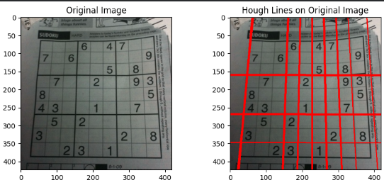

#### Observation

The Hough Line Transform successfully detected the dominant straight lines in the sudoku grid image. Canny edge detection was first applied to extract edge points, which were then voted in the (ρ, θ) Hough parameter space. Lines accumulating more than 200 votes were retained and drawn in blue over the original image. The grid lines of the sudoku puzzle are clearly highlighted, demonstrating the effectiveness of the Hough Transform for structured line detection.

---

### Task 8: Isolated Point Detection

#### Code

```python
import cv2
import numpy as np
import matplotlib.pyplot as plt

image = cv2.imread('/content/turbine.jpg', cv2.IMREAD_GRAYSCALE)

# Point Detection Mask
point_detection_mask = np.array([[-1, -1, -1],
                                  [-1,  8, -1],
                                  [-1, -1, -1]])

filtered = cv2.filter2D(image, -1, point_detection_mask)

# Thresholding — 90% of highest absolute pixel value
T = 0.9 * np.max(filtered)
thresh = filtered > T

# Display Results
fig = plt.figure(figsize=(14, 12))
ax1 = fig.add_subplot(131)
ax2 = fig.add_subplot(132)
ax3 = fig.add_subplot(133)
ax1.imshow(image, cmap='gray')
ax1.title.set_text('Original Image')
ax2.imshow(filtered, cmap='gray')
ax2.title.set_text('After Filtering Using Point Detection Mask')
ax3.imshow(thresh, cmap='gray')
ax3.title.set_text('After Thresholded Filter Image')
plt.show()
```

#### Input Image

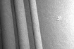

#### Output

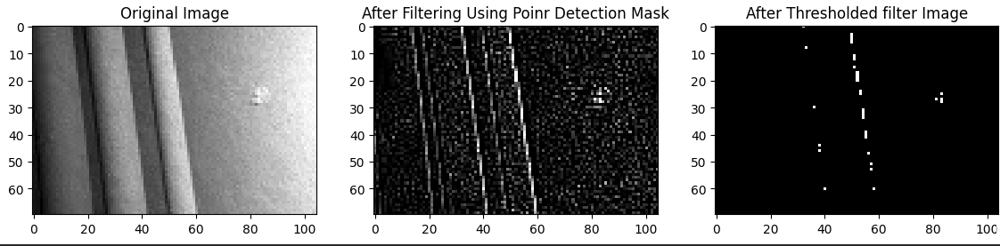

#### Observation

The point detection mask (Laplacian-like kernel with center weight +8 and surrounding weights −1) amplifies pixels that differ significantly from all eight of their neighbors. After filtering, a threshold of 90% of the maximum response was applied to isolate the most extreme points. The thresholded output displays only isolated bright pixels, confirming successful detection of isolated intensity anomalies against a uniform background — useful in identifying defects or foreign particles in structured images.

---

## Conclusion

In this lab, advanced image analysis techniques were successfully implemented using Python and OpenCV. The SIFT algorithm detected scale- and rotation-invariant keypoints on real-world images. Image segmentation using Global, Adaptive, and Otsu thresholding demonstrated different strategies for binarization, with Adaptive thresholding performing best under uneven illumination. Edge detection using Sobel, Laplacian, and Canny methods revealed trade-offs between sensitivity, noise tolerance, and edge precision, with Canny producing the sharpest results. The Hough Line Transform effectively identified straight lines in a structured grid image by analyzing the parameter space of edge points. Finally, isolated point detection using a custom convolution mask successfully identified anomalous pixels that differ from all their neighbors. Together, these techniques form the foundation of feature extraction and scene understanding in computer vision.
