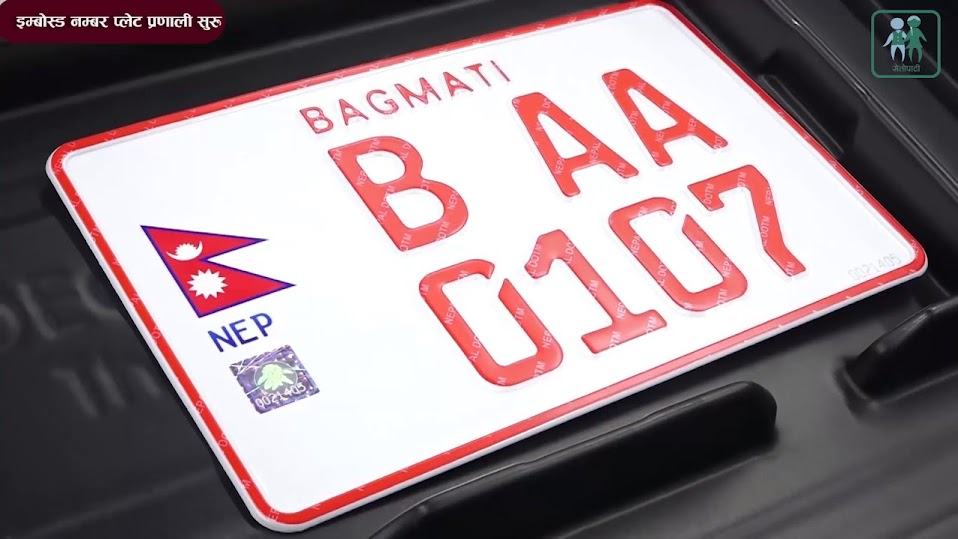
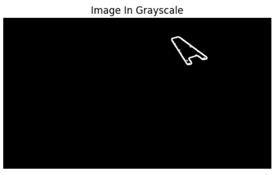
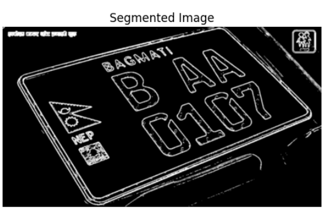
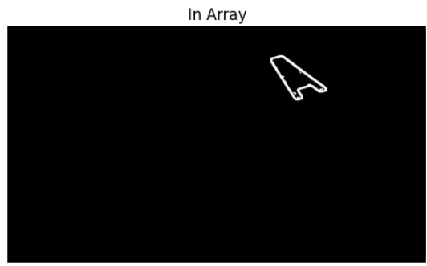
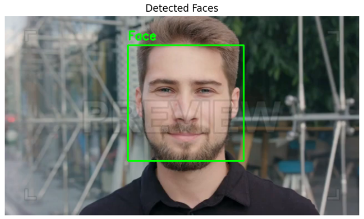

| Field | Details |
|-------|---------|
| **Name** | Oshan |
| **Roll No** | 230328 |
| **Faculty** | BCE |


---

## Title
**Image Processing — Image Segmentation and Pattern Recognition**

---

## Objective

- To segment a number plate image by applying median filtering, Sobel edge detection, convolution with a structural mask, and connected component labeling.
- To perform pattern recognition by detecting human faces in a video frame using the Haar Cascade Classifier.

---

## Theory

### Part I: Image Segmentation

Image segmentation is the process of partitioning a digital image into meaningful regions or objects to simplify analysis.

| Concept | Description |
|---------|-------------|
| Grayscale Conversion | Converts a color image to single-channel intensity representation |
| Median Filtering | Non-linear filter that replaces each pixel with the median of its neighborhood; effective for removing salt-and-pepper noise |
| Sobel Edge Detection | First-order derivative filter that computes image gradient in X and Y directions; the magnitude highlights edges |
| Edge Thresholding | Converts the gradient magnitude to a binary edge map using a fixed threshold value |
| Convolution Mask | A 3×3 structuring element applied via 2D convolution to connect nearby edge pixels |
| Connected Component Labeling | Groups connected foreground pixels into distinct labeled regions for object isolation |
| `convolve2d()` | Performs 2D convolution between the binary edge image and the structural mask |
| `skimage.measure.label()` | Labels connected regions in a binary image with 8-connectivity |

---

### Part II: Pattern Recognition — Haar Cascade Face Detection

Pattern recognition involves identifying patterns (such as faces) in images or video using pre-trained classifiers.

| Concept | Description |
|---------|-------------|
| Haar Cascade Classifier | A machine learning-based object detection method trained on positive and negative image samples using Haar-like features |
| Haar-like Features | Simple rectangular features that capture differences in intensity between adjacent regions |
| `detectMultiScale()` | Detects objects at multiple scales by sliding a detection window across the image |
| `scaleFactor` | Specifies how much the image is scaled down at each level of the image pyramid |
| `minNeighbors` | Minimum number of overlapping detections required to retain a rectangle as a valid face |
| `minSize` | Minimum possible face object size; objects smaller than this are ignored |
| Bounding Box | A rectangle drawn around each detected face using its coordinates (x, y, w, h) |

---

## Lab Tasks

---

### Task 1: Image Segmentation of a Number Plate

#### Code

```python
import cv2
import numpy as np
import matplotlib.pyplot as plt
from scipy.signal import convolve2d
from skimage.measure import label

# Read image
im = cv2.imread('/content/number_plate.jpg')

# Convert BGR to RGB (for displaying)
im_rgb = cv2.cvtColor(im, cv2.COLOR_BGR2RGB)

# Convert to grayscale
im1 = cv2.cvtColor(im, cv2.COLOR_BGR2GRAY)

# Median filtering (3x3)
im1 = cv2.medianBlur(im1, 3)

# Sobel edge detection
grad_x = cv2.Sobel(im1, cv2.CV_64F, 1, 0, ksize=3)
grad_y = cv2.Sobel(im1, cv2.CV_64F, 0, 1, ksize=3)
magnitude = np.sqrt(grad_x**2 + grad_y**2)
BW = (magnitude > 100).astype(np.uint8)  # Threshold can be adjusted

# Image dimensions
imx, imy = BW.shape

# Mask (same as MATLAB)
msk = np.array([
    [0, 0, 0, 0, 0],
    [0, 1, 1, 1, 0],
    [0, 1, 1, 1, 0],
    [0, 1, 1, 1, 0],
    [0, 0, 0, 0, 0]
], dtype=np.uint8)

# Convolution
B = convolve2d(BW.astype(float), msk.astype(float), mode='same')

# Connected component labeling (8-connectivity)
L = label(B > 0, connectivity=2)
mx = L.max()
print("Total Connected Components:", mx)

# Extract component number 17
component_number = 17
n1 = np.zeros((imx, imy), dtype=np.uint8)
if component_number <= mx:
    r, c = np.where(L == component_number)
    n1[r, c] = 255
else:
    print(f"Component {component_number} not found.")

# Display results
plt.figure(figsize=(6, 6))
plt.imshow(im1, cmap='gray')
plt.title("Image in Grayscale")
plt.axis("off")

plt.figure(figsize=(6, 6))
plt.imshow(B, cmap='gray')
plt.title("Segmented Image")
plt.axis("off")

plt.figure(figsize=(6, 6))
plt.imshow(n1, cmap='gray')
plt.title("In Array")
plt.axis("off")

plt.show()
```

#### Input Image



#### Output 1 — Grayscale Image



#### Output 2 — Segmented Image (After Convolution)



#### Output 3 — Isolated Connected Component (Array)



#### Observation

| Step | Observation |
|------|-------------|
| Grayscale Conversion | Color information removed; plate characters appear as distinct intensity regions |
| Median Filtering | Salt-and-pepper noise suppressed while plate edges remain intact |
| Sobel Edge Detection | Character boundaries and plate borders highlighted as a binary edge map |
| Convolution with Mask | Neighboring edge pixels merged into cohesive filled blobs using the 3×3 structural mask |
| Connected Component Labeling | Each distinct blob assigned a unique label; total components printed to console |
| Component Extraction | Component 17 (corresponding to a character/region of interest) isolated and displayed as a white region on black background |

---

### Task 2: Pattern Recognition — Face Detection Using Haar Cascade

#### Code

```python
import cv2
import matplotlib.pyplot as plt

# Load Haar Cascade face detector
face_detector = cv2.CascadeClassifier(
    cv2.data.haarcascades + 'haarcascade_frontalface_default.xml'
)

# Open the video file
video = cv2.VideoCapture('/content/video.mp4')

# Read the first frame
ret, frame = video.read()
if not ret:
    print("Error: Could not read the video.")
    exit()

# Convert frame to grayscale
gray = cv2.cvtColor(frame, cv2.COLOR_BGR2GRAY)

# Detect faces
faces = face_detector.detectMultiScale(
    gray,
    scaleFactor=1.1,
    minNeighbors=5,
    minSize=(30, 30)
)

# Draw rectangles around detected faces
for (x, y, w, h) in faces:
    cv2.rectangle(frame, (x, y), (x + w, y + h), (0, 255, 0), 2)
    cv2.putText(frame, "Face", (x, y - 10),
                cv2.FONT_HERSHEY_SIMPLEX, 0.7,
                (0, 255, 0), 2)

# Convert BGR to RGB for Matplotlib
frame_rgb = cv2.cvtColor(frame, cv2.COLOR_BGR2RGB)

# Display the result
plt.figure(figsize=(8, 6))
plt.imshow(frame_rgb)
plt.title('Detected Faces')
plt.axis('off')
plt.show()

# Release the video
video.release()
```

#### Input

Video file: `video.mp4` — first frame extracted for face detection.

#### Output 4 — Detected Faces



#### Observation

| Parameter | Value | Effect |
|-----------|-------|--------|
| `scaleFactor` | 1.1 | Image reduced by 10% at each pyramid level; detects faces at multiple sizes |
| `minNeighbors` | 5 | Requires at least 5 overlapping detections; reduces false positives |
| `minSize` | (30, 30) px | Ignores faces smaller than 30×30 pixels in the frame |
| Bounding Box Color | Green (0, 255, 0) | Green rectangles drawn around each confirmed face region |
| Label | "Face" | Text label placed 10 pixels above each bounding box |

The Haar Cascade classifier successfully detected frontal faces in the first frame of the video. Each detected face is enclosed in a green bounding box with the label "Face" displayed above it. The pre-trained model from OpenCV's data directory (`haarcascade_frontalface_default.xml`) performed detection without requiring any additional training.

---

## Conclusion

In this lab, two key areas of image processing were explored — image segmentation and pattern recognition. In the first task, a number plate image was processed through a pipeline of grayscale conversion, median filtering, Sobel edge detection, structural mask convolution, and connected component labeling to successfully isolate individual characters or regions from the plate. In the second task, the Haar Cascade Classifier was used to detect human faces in a video frame, demonstrating a real-world application of pre-trained machine learning models for pattern recognition. The combination of classical image processing and cascade-based detection highlights both the fundamentals and practical applications of computer vision.
